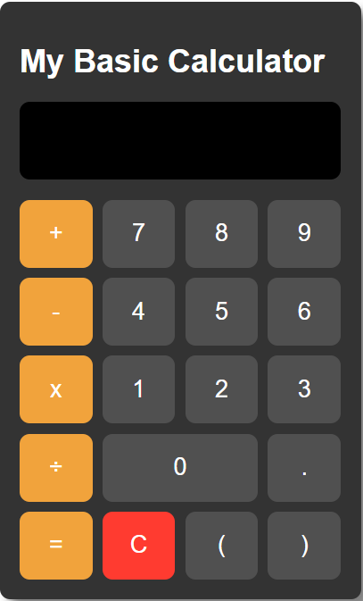
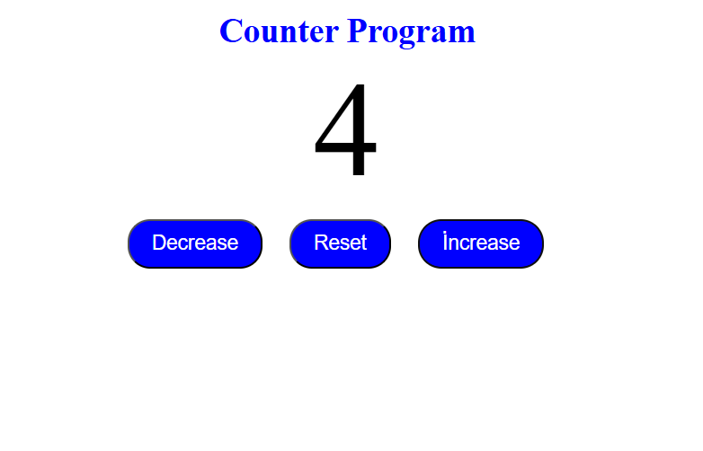
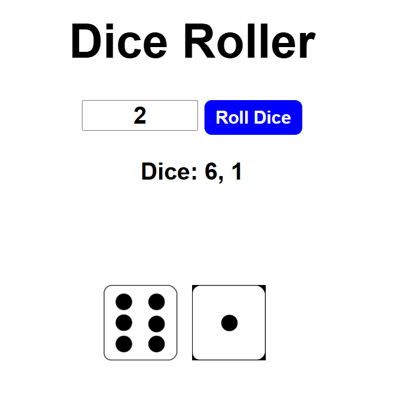
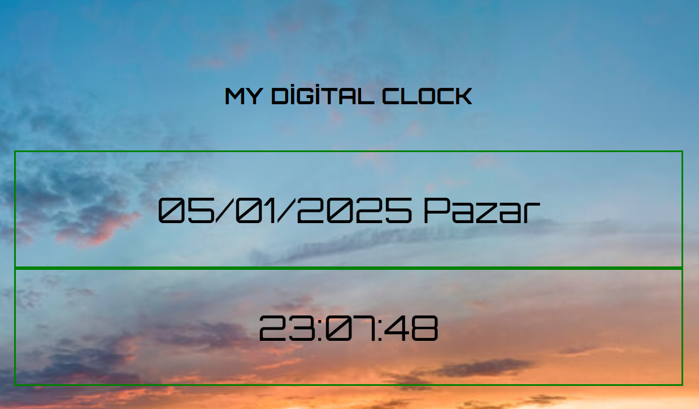
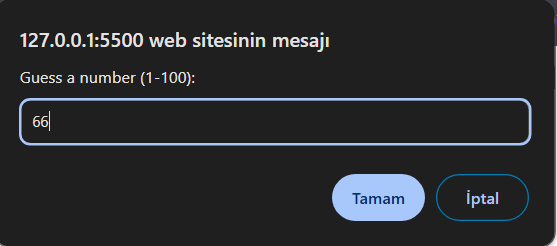
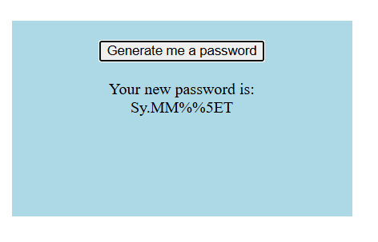
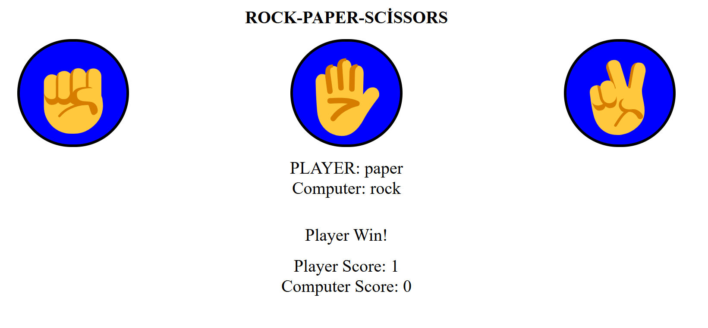
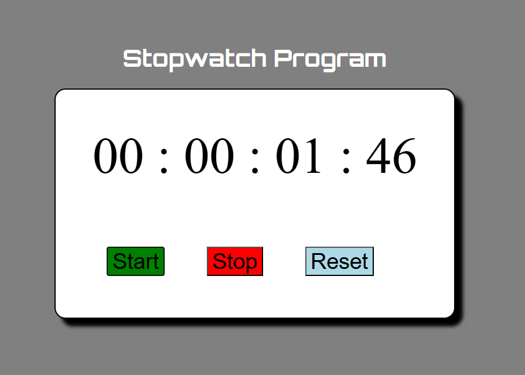
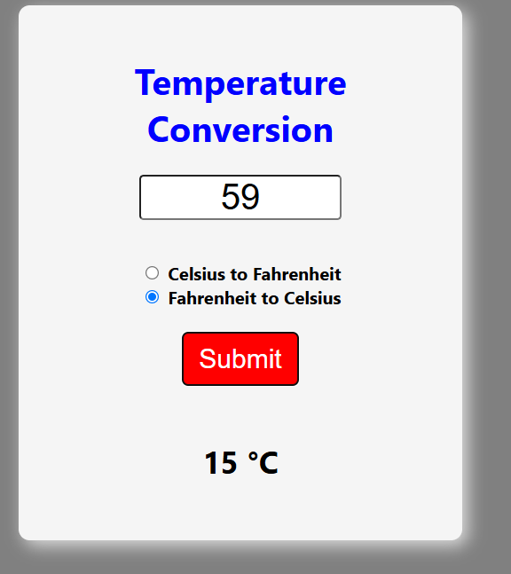
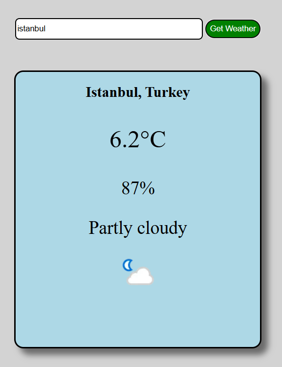

# JavaScript for Practice

Welcome to the JavaScript for Practice repository! This collection of beginner-friendly JavaScript projects is designed to enhance your JavaScript skills through practical exercises. Each project comes with its own functionality and is easy to run locally. Below, you’ll find installation instructions, project descriptions, and screenshots for better understanding.

## 🛠️ Installation

#### 1. Clone the Repository

```bash
git clone https://github.com/cemlevent54/Javascript_for_practice.git

cd Javascript_for_practice
```

#### 2. Run the Project

- Open the `index.html` file of the desired project in your web browser to see it in action.
- Alternatively, you can host the folder using a local server `(e.g., Live Server extension in VS Code)`.

## 🗂️ Projects Overview

### 1. 📱 Calculator

A simple yet functional calculator application for performing basic arithmetic operations such as addition, subtraction, multiplication, and division.



### 2. ➕➖ Counter App

A basic counter application that lets users increment, decrement, or reset the counter value.



### 3. 🎲 Dice Roller

A fun dice roller application where users can roll multiple dice and see the results.



### 4. ⩇⩇:⩇⩇ Digital Clock

A digital clock application that displays the current date and time in a user-friendly format.



### 5. 🖼️ Image Slider

An interactive image slider to browse through a collection of images.


### 6. 🎯 Number Guessing Game

A simple game where the user tries to guess a randomly generated number.



### 7. 🔒 Random Password Generator

A simple application to generate secure, random passwords.



### 8. ✊✋✌️ Rock, Paper, Scissors

A classic game where the user competes against the computer.



### 9. ⏱️ Stopwatch

A simple stopwatch application to measure elapsed time.



### 10. 🌡️ Temperature Conversion

An application to convert temperatures between Celsius and Fahrenheit.



### 10. ☁️ Weather App

A weather application that displays real-time weather information for any city.

- How to get an api key?

1. Go to `weatherapi.com` and sign up for an account.
2. Once logged in, navigate to the API Keys section in your dashboard.
3. Copy the provided API key.
4. Open `index.js` from the Weather Application project folder and paste your api key to apikeys variable.

   ```bash
   const apiKey = 'your-api-key-from-weatherapi.com';
   ```

5. Save the file and run the project to fetch real-time weather data.



---

## Contributing

Contributions are welcome! If you want to add a new project or improve an existing one:

1. Fork the repository.

2. Create a new branch: `git checkout -b feature/your-feature`.

3. Commit your changes: `git commit -m 'Add your feature'`.

4. Push to the branch: `git push origin feature/your-feature`.

5. Open a pull request.
